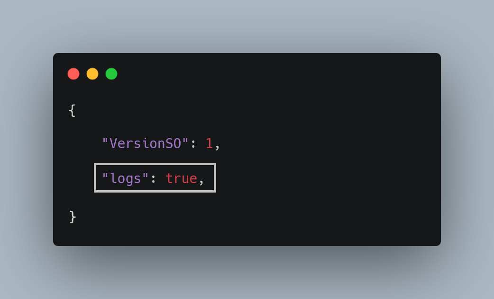
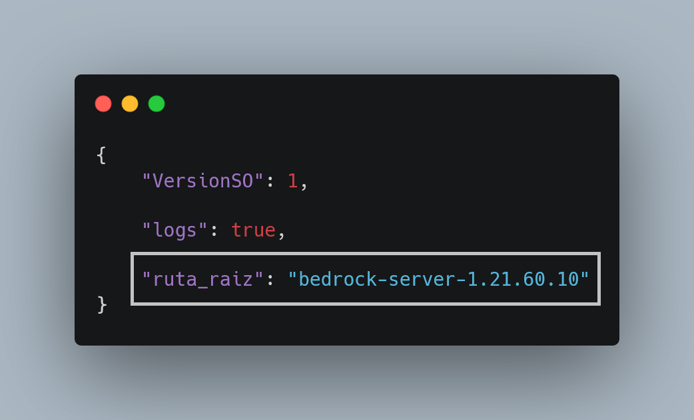
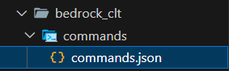
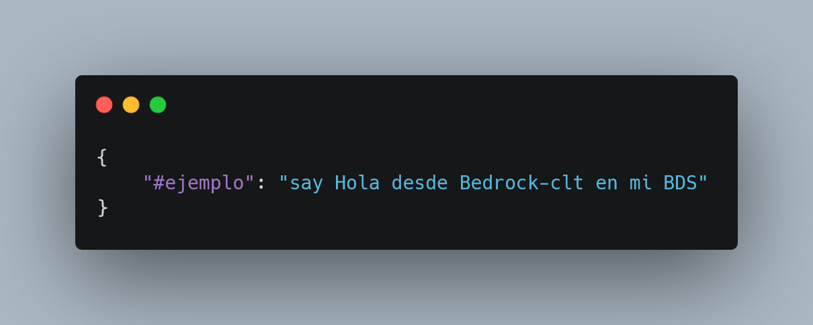
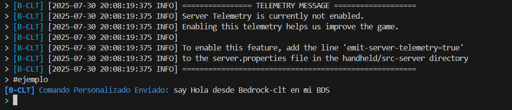

## 📦 Configuracion de BEDROCK-CLT
Antes de iniciar `Bedrock-CLT` por primera vez hay que iniciar con la configuracion, esto incluye instalar librerias previas para el buen funcionamiento.


### 1️⃣ Primer Paso
Instalar librerias nesesarias.
```bash
pip install colorama
```
o simplemente usar requirements.txt

```bash
pip install -r requirements.txt
```

<br></br>

### 2️⃣ Segundo Paso
Configurar el archivo `config.json` que contiene funciones que definen el comportamiento de `Bedrock-CLT` frente **BDS**.

#### ➡️ **Definir El Entorno SO:**


`Bedrock-CLT` solo esta disponible para dos versiones de SO y  a continuacion su respectivo valor en **config.json**:
```bash
> Ubuntu/Linux == "VersionSO: 0"

> Windows == "VersionSO: 1"
```
<br></br>

#### ➡️ **Funcion "logs":**


La variable "logs", define si `Bedrock-CLT` guardara de forma constante los datos entregados por **Bedrock Dedicater Server**.
```bash
> ¿Guardar informacion? == "logs: true"

> ¿NO guardar informacion? == "logs: false"
```
<br></br>

#### ➡️ **Añadir una Ruta Personalizada:**

Esta variable no viene por defecto en **config.json**, ya que es una funcion un poco oculta solamente disponible para `Windows` y solo si el usuario la nesecita.

Permite colocar una ruta o carpeta que contenga `bedrock_server.exe`. 

Ejemplo de una estructura:
```bash
├ bedrock-clt/
│   └── commands/
│   └── modules/
│   └── config.json
│
├ bedrock-server-1.21.70.10/
│ # └── bedrock_server.exe
│ 
├ bedrock-clt.py
```
Entonces solo se colocara la carpeta en donde se encuentra `bedrock_server.exe`. entonces:
> "ruta_raiz": "bedrock-server-1.21.70.10"

Seria el valor de "ruta_raiz", NO la ruta incluyendo el archivo, solo la ruta que conduce a la carpeta que contiene el archivo `bedrock_server.exe`.

<br></br>

### ➡️ **Configuracion en Comandos Personalizados**
Para añadir comandos personalizados a `Bedrock-CLT`, es nesesario modificar el archivo **commands.json** que se encuentra en la ruta: **`bedrock_clt/commands/commands.json`**



Este archivo es el que nos permitira crear comandos persornalizados para ejecutarlos desde `Bedrock-CLT` con **#**, actualmente el archivo **commands.json** contiene la siguiente estructura:



Si decidimos ejecutar este comando desde `Bedrock-CLT` ya iniciado se ejecutara el valor de la clave definida en el json, Ejemplo:



Se ejecutara con exito! el comando nativo de minecraft bedrock definido en **commands.json**. Se pueden añadir tantos comandos como sean nesesarios para el usuario.

```bash
# Muy Pronto se añadira funciones para ejecutar comandos en secuencia, en vez de comandos que se ejecuten una sola vez.
```