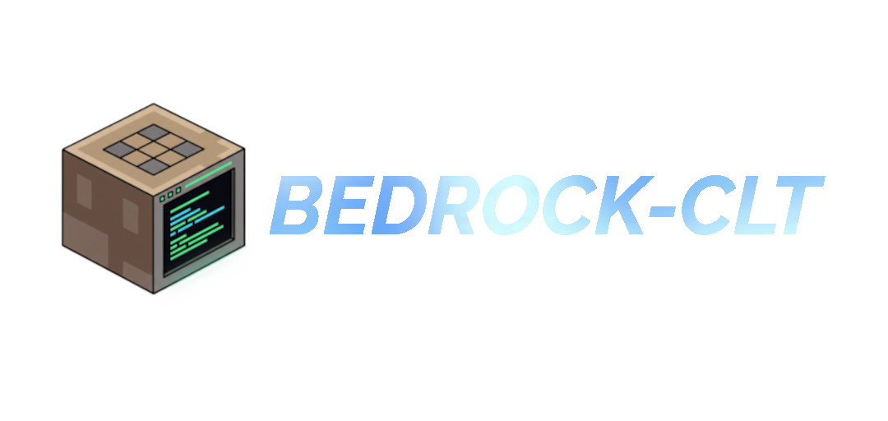

# Bedrock-CLT

Mejora tu servidor de Minecraft bedrock con Bedrock-CLT.  
Mejora Visual, Crea Eventos, Comandos, y mucho mas.  
Todo, desde consola. Sin complicaciones.

   
  

  

## 📋 Descripción
Herramienta `desarrollada en python` en línea de comandos, diseñada para dar un toque nuevo, colorido y mas tecnico/automatico a la consola nativa de **Minecraft Bedrock Servidor** mas conocido como **BDS (Bedrock Dedicate Server)**. Hasta ahora `Bedrock-CLT` es compatible con todas las versiones a partir de la 1.16.x y posteriores de **BDS**.

`Bedrock-CLT` esta diseñada en el lenguaje de programacion **Python**, y esta preparada para trabajar en entorno SO tanto de **Windows** y **Ubuntu/Linux**. de igual manera el <a href="https://www.python.org/downloads/">Programa/Interprete Python</a> esta disponible desde su sitio oficial. "si trabaja en Linux no es nesesario realizar este paso".

> **⚠️ Nota:** 
>
>`Bedrock-CLT` Usa JSON para comunicarse con el usuario, por lo cual no es nesesario tocar el codigo fuente, por otro se pueden crear sistemas interesantes con python y BDS, tocando el codigo fuente de `Bedrock-CLT`. 
>
>(En BDS se pueden usar scoreboars, y una escucha en la funcion `Leer_logs()`, Se pueden obtener datos de Minecraft).
>

---
## 🚀 Características

- 📜 **Logs en tiempo real**
- 👥 **Gestión de jugadores conectados**
- 🔔 **Eventos personalizados**
- 🖥️ **Interfaz de consola sencilla y potente**
- 🔐 **Permisos de operador desde ejecución**
- 🧩 **Modular y fácil de extender**

---

## 📦 Requisitos

- Python 3.11 o superior
- Servidor BDS configurado correctamente

---
## ⚙️ Configuracion
La Configuracion Inicial se encuentra en el siguiente enlace:
[Configuracion](Configuracion.md).

---
## 📄 Licencia
Este proyecto está licenciado bajo la **Bedrock-CLT License v1.0**.  
Puedes leer los términos completos en el archivo [`LICENSE`](License.md).

